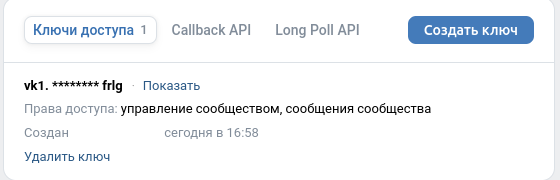
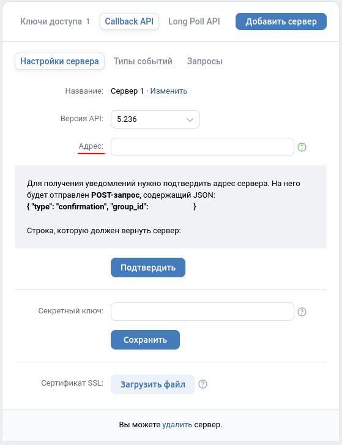

## Бот для VK (эхо-бот)

### Параметры для запуска

> + __vk.group.id=__ _id группы в вк к которому привязан бот_  
> + __vk.access.key=__ _ключ доступа с параметрами "управление сообществом" и "сообщения сообщества"_  
> + __vk.secret=__ _секретный ключ_  

### Запуск на локальном сервере c использованием ngrok через Spring Boot

> + __ngrok.enabled=true__  
> + __ngrok.authToken=__ _токен авторизации в ngrok_  
> + __url адрес:__ _в консоли после старта приложения и старта ngrok в строке Remote url (https) ->_  

### Запуск на локальном сервере используя ngrok отдельно или на remote сервере

> + __ngrok.enabled=false__

### Настройки в VK 

> #### vk.access.key
> 
> 

> #### vk.secret
> 
> 

> #### url
> 
> 
